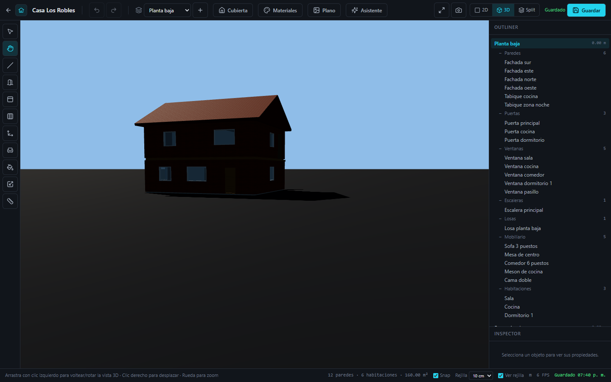
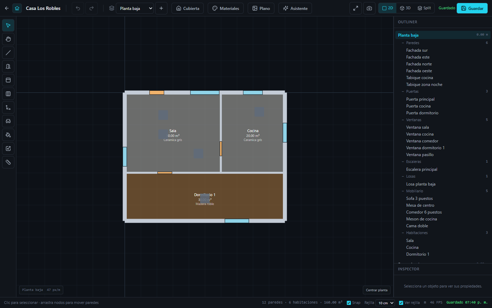
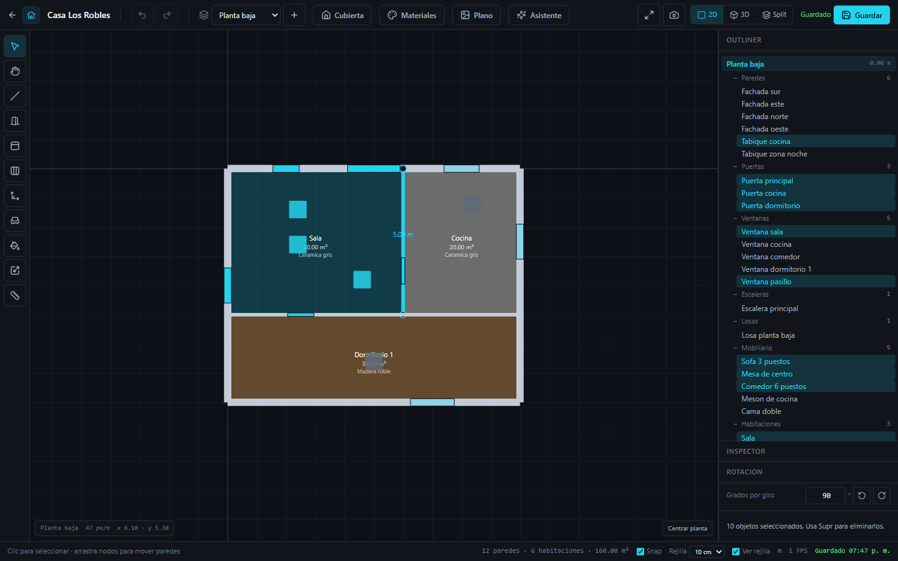

# 1. Últimos cambios

Este documento resume la historia reciente de la rama `Develop`, del más nuevo al más antiguo.

## Resumen de ramas

| Rama | Último commit | Estado frente a `main` |
|------|---------------|------------------------|
| `Develop` | `a395906` Fix: poner suelos y puertas, aparte se agrega opcion para mover la vista 3D | **1 commit por delante**: tiene cambios que aún no están en `main` |
| `main` | `d3f2340` Merge pull request #4 from Txllagts/Pre-release | Estable |
| `Pre-release` | Merge pull request #3 from Txllagts/Backend-Ia | Integrada en `main` |
| `Backend-Ia` | `45beb28` feat: seleccion multiple, mover y rotar objetos en 2D/3D | Integrada en `main` y `Develop` |
| `Frontend-y-ui` | `f8c62ba` feat: plataforma ArchVision 3D AI (fases 1-7) | Sin cambios desde agosto |

## Historial

| Fecha | Commit | Autor | Descripción |
|-------|--------|-------|-------------|
| 2026-09-27 | `a395906` | Jasbeith Prada | Suelos de habitación con material, herramienta **Mover y rotar vista 3D** (`H`), eliminación de la página *Equipo* |
| 2026-09-27 | `66455d2` | Jasbeith Prada | Merge de `Backend-Ia` en `Develop` |
| 2026-09-27 | `45beb28` | Snayder07 | Selección múltiple, mover y girar objetos en 2D/3D |
| 2026-09-21 | `0d25dc2` | Jasbeith Prada | fix(storage): índice posiblemente indefinido en `readUInt32BE` |
| 2026-09-21 | `29bb443` | Jasbeith Prada | fix(ci): módulos de almacenamiento que faltaban y `.gitignore` |
| 2026-09-21 | `b080abf` | Jasbeith Prada | README más claro y correcciones de CI |
| 2026-09-21 | `42fc0c9` | Txllagts | Importación de plano, conexión a Supabase y página *Equipo* |
| 2026-08-13 | `f8c62ba` | JuanDavid-dev-lang | Plataforma inicial (fases 1 a 7) |

---

## `a395906`: suelos, puertas y vista 3D libre

**Rama:** `Develop` · **Autor:** Jasbeith Prada · **11 archivos, +195 / −885 líneas**

### Nueva herramienta: Mover y rotar vista 3D (`H`)

Hay un botón nuevo con icono de mano en la barra de herramientas izquierda, justo debajo de *Seleccionar*. También se activa con las teclas `H` o `Q` y con la paleta de comandos (`Ctrl+K`).

| Acción | Con la herramienta *Mover vista* (`H`) | Con otras herramientas |
|--------|----------------------------------------|------------------------|
| Clic izquierdo + arrastrar | Orbita (rota) la cámara | Selecciona o dibuja |
| Clic derecho + arrastrar | Desplaza (pan) la cámara | Orbita la cámara |
| Botón central + arrastrar | Desplaza la cámara | Desplaza la cámara |
| Rueda | Zoom | Zoom |

Con esta herramienta la cámara puede bajar **por debajo del plano del suelo** (`maxPolarAngle = π − 0.05`). Así se puede mirar la casa desde abajo. Con las demás herramientas el límite sigue en el horizonte. En la vista 2D, arrastrar con la herramienta activa desplaza el plano y el cursor cambia a una mano.

Mientras está activa, los clics sobre objetos no seleccionan ni resaltan nada. Así el usuario no mueve un objeto por accidente al navegar.

**Archivos:** `toolbar.tsx`, `use-shortcuts.ts`, `command-palette.tsx`, `status-bar.tsx`, `store.ts` (nuevo `ToolId` `"pan"`), `viewport-3d.tsx`, `viewport-2d.tsx`.

### Suelos de habitación con material

Cada habitación detectada tiene ahora una malla de suelo propia (`RoomFloorObject` en `scene-objects.tsx`). Es una capa de 2 mm sobre el nivel de la planta y puede recibir materiales con el pincel (`G`) o arrastrando una muestra.

- **En 3D:** sin material, el suelo es invisible pero sigue ahí para que el raycaster lo detecte. Al pasar el ratón por encima se resalta en azul.
- **En 2D:** si la habitación tiene material, el polígono se rellena con el color base del material al 55 % de opacidad. Debajo del área aparece el nombre del material.

### Página *Equipo* eliminada

Se borraron `apps/web/src/app/(app)/team/page.tsx` y `components/team/role-assignment-view.tsx` (852 líneas), además de su enlace en la barra lateral. La página se había agregado en `42fc0c9`.

---

## `45beb28`: selección múltiple, mover y girar

**Rama:** `Backend-Ia` · **Autor:** Snayder07 · **17 archivos, +1888 / −135 líneas**

- **Selección por recuadro (marquee)** en 2D y 3D:
  - De izquierda a derecha: selecciona los objetos que quedan **completamente dentro**.
  - De derecha a izquierda: selecciona los que **tocan** el recuadro.
- **`Ctrl+A`** selecciona todo lo visible de la planta activa.
- **Arrastrar objetos en 3D:** si el objeto ya forma parte de una selección múltiple, se mueve todo el grupo. Al soltar se emite un único comando `TRANSFORM_OBJECTS`, que se deshace con un solo `Ctrl+Z`.
- **Giro interactivo:** un tirador circular sobre el pivote de la selección. Por defecto el giro es libre; con `Shift` se ajusta al incremento guardado en el inspector (de 1° a 360°, se guarda en `localStorage`).
- **Cubiertas con pose propia:** `Roof` tiene ahora `position` y `rotationY` opcionales. Antes, girar una cubierta la deformaba. Las escenas antiguas se siguen leyendo, con giro 0.
- Nuevo módulo `packages/shared/src/selectable-bounds.ts`: es la fuente única de las cajas envolventes de cada entidad y de sus dependencias (un vano depende de su muro; una habitación, de sus muros).
- Nuevas pruebas en `editor.test.ts` y `selectable-bounds.test.ts`.

Detalle técnico: [`docs/SELECTION_AND_TRANSFORMS.md`](../SELECTION_AND_TRANSFORMS.md).

---

## `42fc0c9` → `0d25dc2`: Supabase, almacenamiento y CI

- **Supabase:** el esquema de Prisma usa ahora `provider = "postgresql"` con `url` y `directUrl`. `.env.example` explica `DATABASE_URL` (Transaction Pooler, puerto 6543) y `DIRECT_URL` (Session Pooler, puerto 5432).
- **Almacenamiento:** se agregaron `apps/web/src/lib/storage/index.ts` y `sniff.ts`, que faltaban en el repositorio y rompían el typecheck de CI. `sniff.ts` detecta el tipo real de un archivo por sus primeros bytes, no por la extensión.
- **README:** se reescribió con una guía de puesta en marcha para los miembros del equipo.

## Impacto para el equipo

1. **Hay que llevar `Develop` a `main`.** La herramienta de vista 3D y los suelos todavía no están en `main`.
2. **Las migraciones de Prisma no coinciden con Supabase.** Ver [Problemas conocidos](04-problemas-conocidos.md#1-migraciones-de-prisma-en-sqlite).
3. **Una prueba de `three-engine` falla** después de los cambios en la casa demo. Ver [Problemas conocidos](04-problemas-conocidos.md#2-prueba-fallida-en-three-engine).
