# 2. Guía de uso

Recorrido por ArchVision 3D AI desde el registro hasta el modelado en el editor. Las capturas corresponden a la cuenta de demostración y al proyecto **Casa Los Robles**.

> **Cuenta de demostración** (después de ejecutar `pnpm db:seed`): `demo@archvision.app` / `arquitectura2026`

## Contenido

1. [Página de inicio](#21-página-de-inicio)
2. [Registro e inicio de sesión](#22-registro-e-inicio-de-sesión)
3. [Panel principal](#23-panel-principal)
4. [Proyectos](#24-proyectos)
5. [El editor](#25-el-editor)
6. [Vistas 2D, 3D y dividida](#26-vistas-2d-3d-y-dividida)
7. [Navegar por la vista 3D](#27-navegar-por-la-vista-3d)
8. [Herramientas de modelado](#28-herramientas-de-modelado)
9. [Seleccionar, mover y girar](#29-seleccionar-mover-y-girar)
10. [Materiales](#210-materiales)
11. [Cubiertas](#211-cubiertas)
12. [Importar un plano](#212-importar-un-plano)
13. [Asistente, revisión y tutorial](#213-asistente-revisión-y-tutorial)
14. [Paleta de comandos](#214-paleta-de-comandos)
15. [Configuración, facturación y papelera](#215-configuración-facturación-y-papelera)
16. [Atajos de teclado](#216-atajos-de-teclado)

---

## 2.1 Página de inicio

Al abrir `http://localhost:3000` aparece la página pública del producto. Desde aquí se accede al registro y al inicio de sesión.

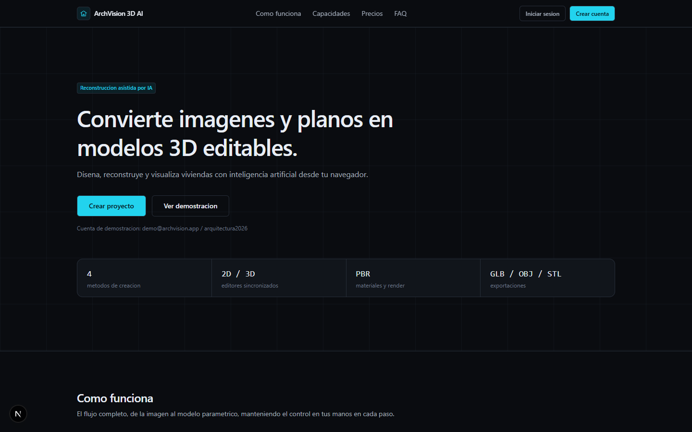

## 2.2 Registro e inicio de sesión

- **Crear cuenta** (`/register`): pide nombre, correo y contraseña.
- **Iniciar sesión** (`/login`): pide correo y contraseña. La sesión dura 30 días, o el valor de `SESSION_TTL_DAYS`.

| Registro | Inicio de sesión |
|----------|------------------|
| 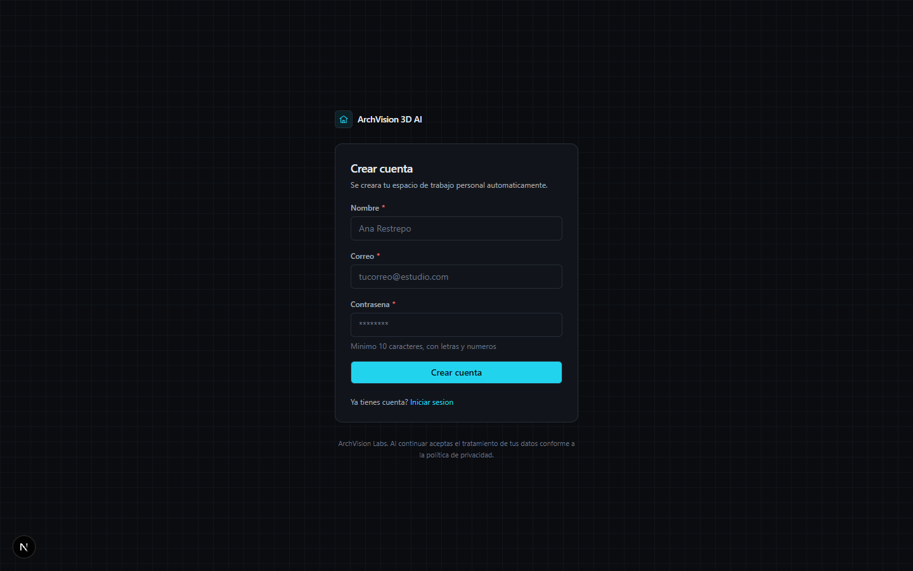 | 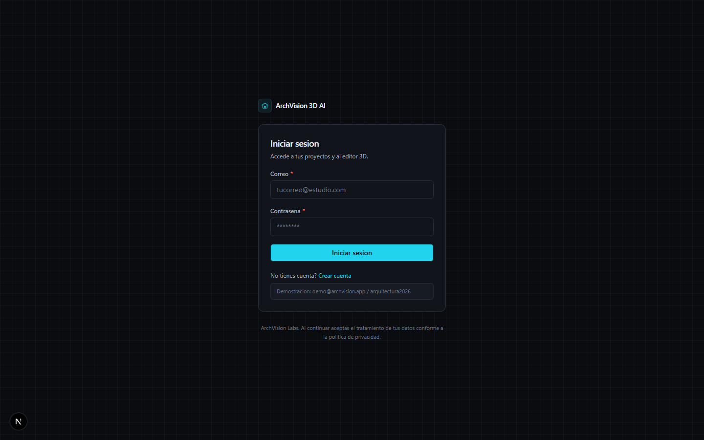 |

## 2.3 Panel principal

Después de iniciar sesión se abre **Inicio** (`/dashboard`). Muestra:

- **Tarjetas de resumen:** proyectos activos, en procesamiento, almacenamiento usado y proyectos en la papelera.
- **Proyectos recientes**, ordenados por última modificación.
- **Cargar casa demo:** crea una copia de la casa de ejemplo de dos plantas.
- **Nuevo proyecto.**

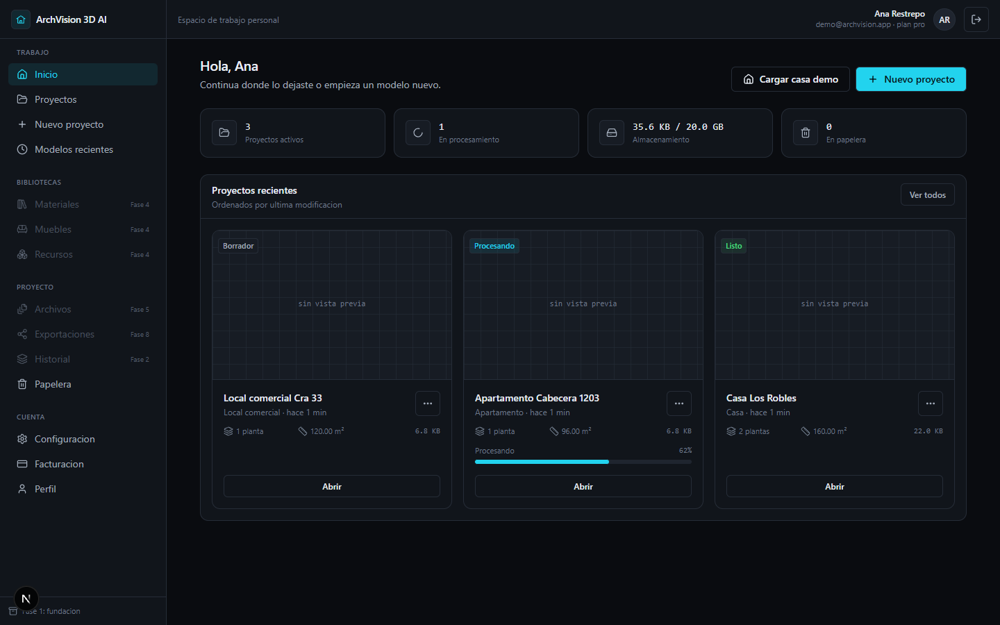

La barra lateral agrupa las secciones. Las que aún no existen aparecen en gris con la fase en la que llegarán (por ejemplo *Exportaciones · Fase 8*).

## 2.4 Proyectos

### Lista de proyectos

**Proyectos** (`/projects`) lista todos los proyectos del espacio de trabajo y tiene un buscador por nombre. Cada tarjeta muestra:

- Estado: *Borrador*, *Procesando* o *Listo*.
- Número de plantas, área y tamaño.
- Botón **Abrir**.

El menú `⋯` de cada tarjeta permite **duplicar**, **ver versiones** o **enviar a la papelera**.

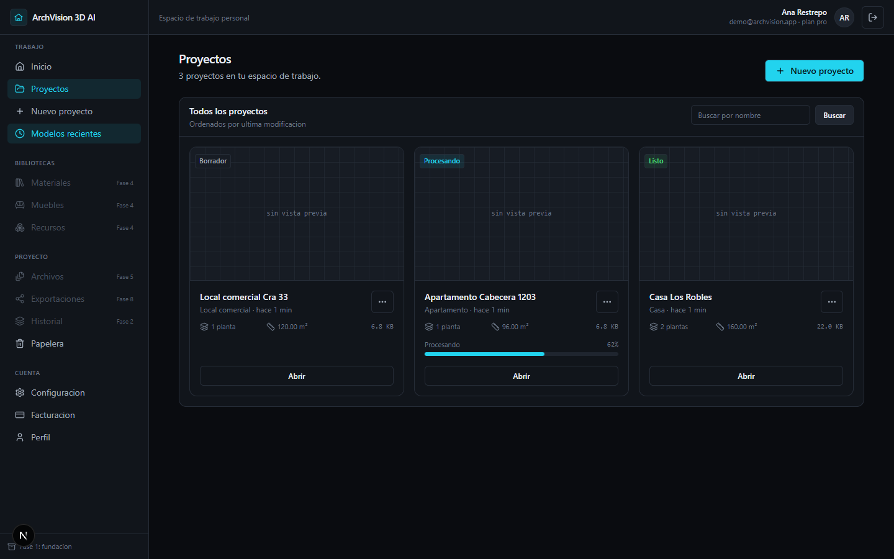

### Crear un proyecto

**Nuevo proyecto** (`/projects/new`) pide nombre, tipo de edificación y datos básicos. Al guardar se crea una escena vacía y se abre el proyecto.

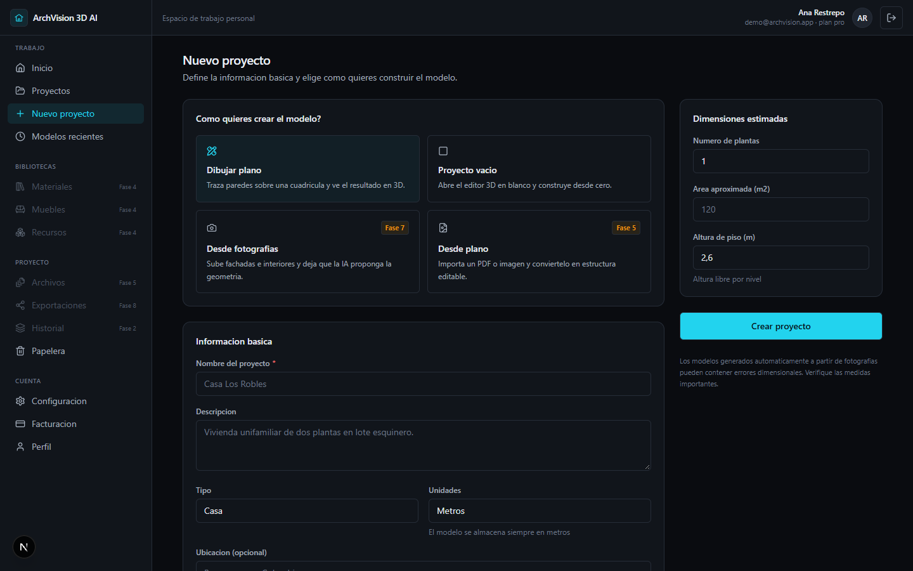

## 2.5 El editor

Al abrir un proyecto y pulsar **Abrir editor** se llega a `/projects/{id}/editor`. La primera vez aparece la tarjeta **Primeros pasos** con los controles básicos.

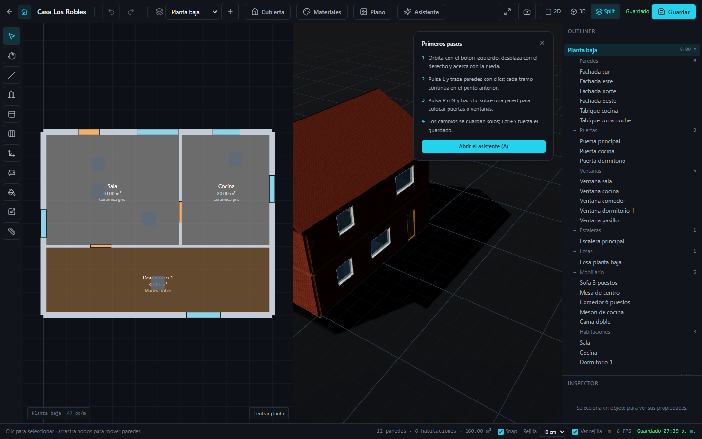

Partes del editor:

| Zona | Contenido |
|------|-----------|
| **Barra superior** | Volver, nombre del proyecto, deshacer/rehacer, selector de planta y `+` para añadir planta, botones **Cubierta**, **Materiales**, **Plano**, **Asistente**, pantalla completa, captura, modo de vista (**2D / 3D / Split**), estado de guardado y **Guardar** |
| **Barra de herramientas** (izquierda) | Seleccionar, mover vista, pared, puerta, ventana, columna, escalera, mobiliario, pincel, calibrar y medir |
| **Visor** (centro) | Plano 2D, modelo 3D o ambos |
| **Outliner** (derecha, arriba) | Árbol de la escena por planta: paredes, puertas, ventanas, escaleras, losas, cubiertas, mobiliario y habitaciones. Cada elemento se puede **ocultar** o **bloquear** |
| **Inspector** (derecha, abajo) | Propiedades del objeto seleccionado |
| **Barra de estado** (abajo) | Ayuda de la herramienta activa, estadísticas del modelo, *Snap*, tamaño de rejilla, *Ver rejilla*, FPS y hora del último guardado |

> **Todo se guarda solo.** El indicador *Guardado* de la barra superior confirma el último guardado. `Ctrl+S` guarda al momento.

## 2.6 Vistas 2D, 3D y dividida

Los botones **2D**, **3D** y **Split** de la barra superior cambian el modo de vista. La tecla `Tab` alterna entre ellos. Las dos vistas editan el mismo modelo: un cambio en la planta 2D aparece al instante en el 3D, y al revés.

**Vista 2D (planta):** muestra muros, vanos (puertas en naranja, ventanas en celeste), habitaciones con su nombre, área y material de suelo, y el mobiliario.

**Vista 3D:** muestra el modelo con materiales, sombras y cubierta.

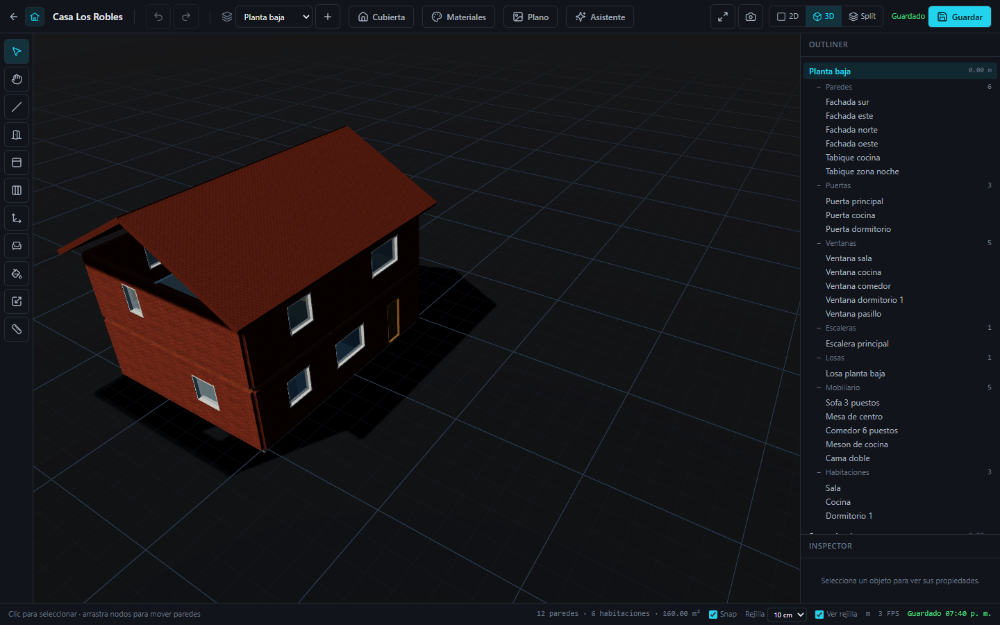

**Vista dividida (Split):** muestra el plano a la izquierda y el modelo 3D a la derecha.

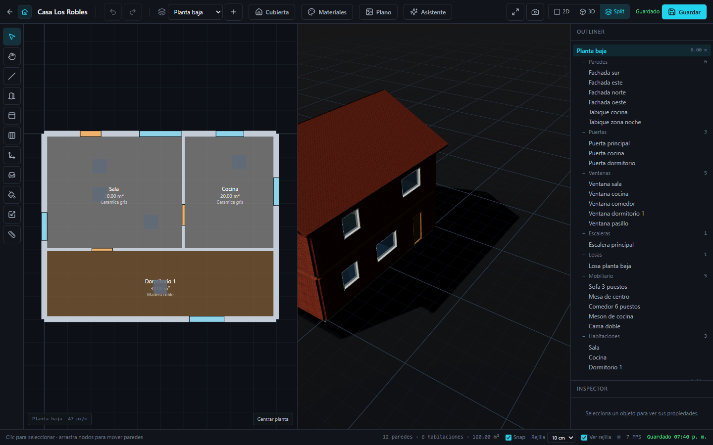

Encuadres rápidos en 3D: `1` vista frontal, `2` lateral, `3` superior, `0` perspectiva y `F` centra la selección. En 2D, el botón **Centrar planta** reencuadra el plano.

## 2.7 Navegar por la vista 3D

> **Nuevo en `Develop`:** herramienta **Mover y rotar vista 3D** (icono de mano, tecla `H`).

| Acción | Herramienta *Mover vista* (`H`) | Herramienta *Seleccionar* (`V`) |
|--------|---------------------------------|---------------------------------|
| Clic izquierdo + arrastrar | Rota la cámara alrededor del modelo | Selecciona o arrastra objetos |
| Clic derecho + arrastrar | Desplaza la cámara | Rota la cámara |
| Botón central + arrastrar | Desplaza la cámara | Desplaza la cámara |
| Rueda del ratón | Zoom | Zoom |

Con **Mover vista** la cámara también puede ir por debajo del suelo. Mientras está activa no se seleccionan objetos, así no se mueve nada por accidente.

## 2.8 Herramientas de modelado

| Herramienta | Tecla | Cómo se usa |
|-------------|-------|-------------|
| Seleccionar | `V` | Clic para seleccionar; arrastrar nodos de pared para moverlos |
| Mover vista | `H` / `Q` | Ver [2.7](#27-navegar-por-la-vista-3d) |
| Pared | `L` | Clic para el primer punto y clic para cada tramo siguiente. Los tramos se encadenan. `Esc` termina |
| Puerta | `P` | Clic sobre una pared. El hueco se abre al instante |
| Ventana | `N` | Clic sobre una pared |
| Columna | `C` | Clic en el plano |
| Escalera | botón | Escalera paramétrica |
| Mobiliario | `B` | Coloca muebles del catálogo |
| Pintar material | `G` | Abre la biblioteca y carga el pincel. Ver [2.10](#210-materiales) |
| Calibrar plano | `K` | Fija la escala de un plano importado |
| Medir | `M` | Clic en dos puntos para ver la distancia |

**Dibujar una pared:** la línea discontinua muestra la longitud en tiempo real. El *snapping* se ajusta a vértices, puntos medios, ejes ortogonales y rejilla. Se desactiva con la casilla *Snap* de la barra de estado.

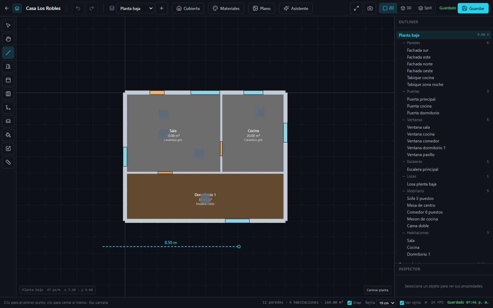

Al cerrar un recinto con paredes, la **habitación se detecta sola** y aparece con su área en la planta y en el outliner.

## 2.9 Seleccionar, mover y girar

**Selección simple:** clic sobre un objeto en el visor o en el outliner. El inspector muestra sus propiedades editables. En una pared: longitud, altura, grosor, coordenadas de inicio y fin, y material por cara.

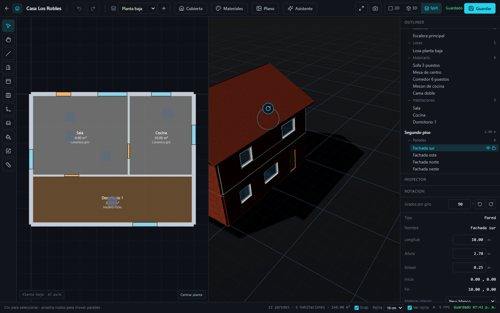

**Selección múltiple:**

- `Shift + clic` añade objetos a la selección.
- **Recuadro:** arrastrar en una zona vacía.
  - **De izquierda a derecha:** selecciona lo que queda **completamente dentro**.
  - **De derecha a izquierda:** selecciona lo que **toca** el recuadro.
- `Ctrl+A` selecciona todo lo visible en la planta activa.

| Durante el arrastre | Resultado |
|---------------------|-----------|
| 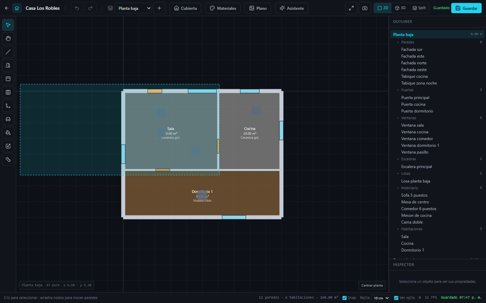 |  |

**Mover (3D):** arrastra un objeto seleccionado. Si forma parte de un grupo, se mueve todo el grupo. Las puertas y ventanas arrastran su pared.

**Girar (3D):**

1. Selecciona uno o varios objetos.
2. Arrastra el **tirador circular** que aparece sobre la selección.
3. Para girar a saltos fijos, mantén `Shift` mientras arrastras. El tamaño del salto se elige en el campo **Grados por giro** del inspector y se recuerda entre sesiones.
4. Los botones ⟲ ⟳ del inspector giran exactamente ese número de grados.

Cada movimiento o giro se deshace con un solo `Ctrl+Z`. `Supr` elimina la selección.

## 2.10 Materiales

El botón **Materiales** (o la tecla `G`) abre la biblioteca de materiales. Tiene búsqueda y filtros por *Muros*, *Suelos*, *Cubiertas*, *Mobiliario* y *Carpintería*. Todos los materiales tienen textura procedural (ladrillo, madera, cerámica, piedra, concreto, pintura, etc.).

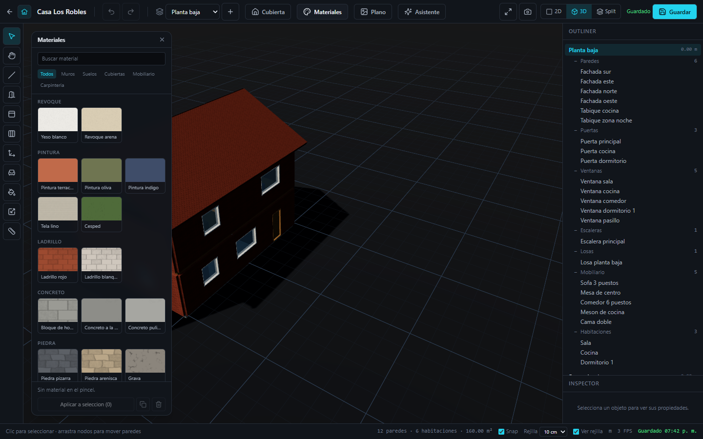

Hay tres formas de aplicar un material:

1. **Arrastrar** una muestra y soltarla sobre una superficie del modelo 3D.
2. **Pincel:** clic en una muestra para cargarla y después clic sobre las superficies, en 3D o en la planta.
3. **Aplicar a selección:** selecciona varios objetos y pulsa el botón inferior del panel.

> **Nuevo en `Develop`:** los **suelos de las habitaciones** reciben material. En la planta 2D la habitación se colorea con el tono del material y muestra su nombre (en la captura, *Dormitorio 1* en madera de roble).

Los materiales del catálogo no se editan directamente. Primero se duplican con el icono de copiar.

## 2.11 Cubiertas

El botón **Cubierta** despliega los tipos disponibles: **dos aguas**, **cuatro aguas**, **una pendiente** y **plana**. La cubierta se genera sobre el contorno de la planta activa. Su pendiente, alero y espesor se ajustan en el inspector.

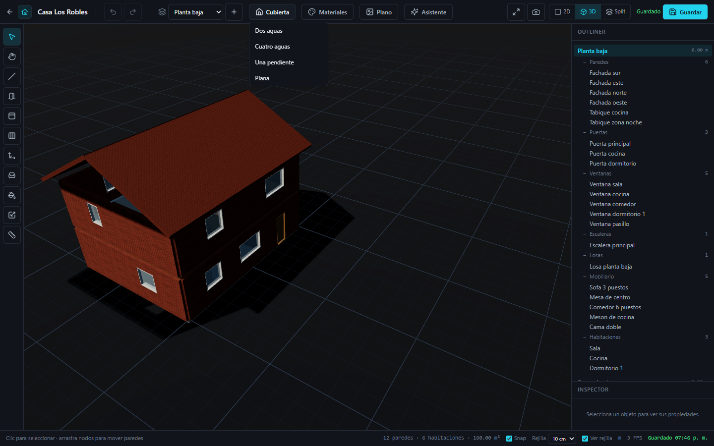

## 2.12 Importar un plano

El botón **Plano** abre el panel de importación:

1. **Subir** una imagen del plano (PNG, JPG, WebP o PDF).
2. **Calibrar** (`K`): marca sobre el plano dos puntos de una medida conocida y escribe su longitud real.
3. **Analizar:** la detección automática propone muros (umbral de Otsu y transformada de Hough).
4. **Revisar:** acepta solo los muros bien trazados. Todo se deshace con `Ctrl+Z`.

El plano queda como calco debajo del modelo para dibujar encima.

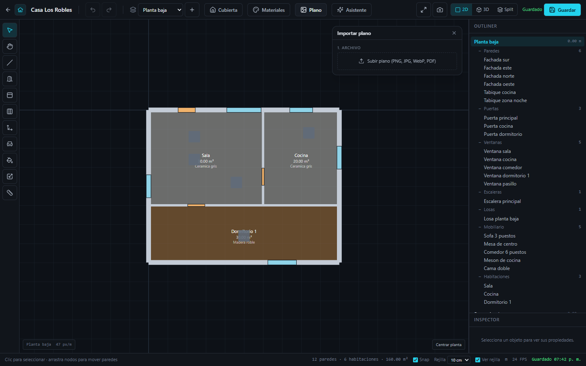

Detalles: [`docs/PLAN_IMPORT.md`](../PLAN_IMPORT.md).

## 2.13 Asistente, revisión y tutorial

El botón **Asistente** (o la tecla `A`) abre un panel con tres pestañas.

**Asistente:** pide cambios en lenguaje natural, por ejemplo *"añade una puerta"* o *"¿cuánta área tengo?"*. El asistente propone los cambios y **nada se aplica sin tu aprobación**. Cada propuesta se deshace con `Ctrl+Z`.

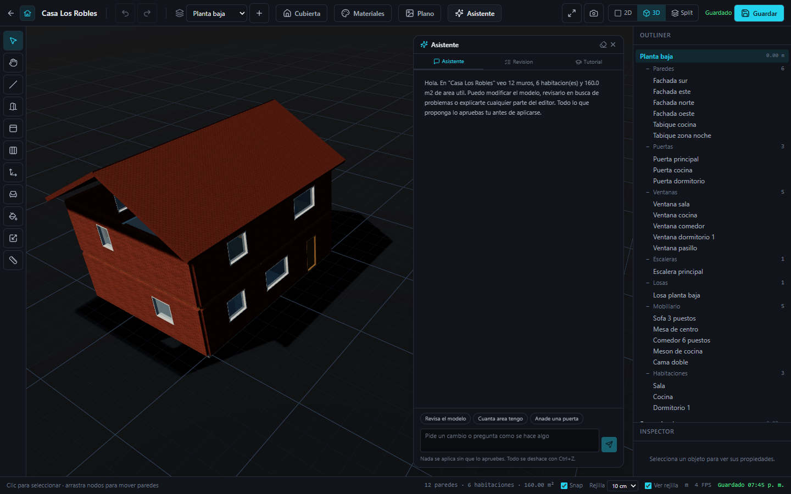

**Revisión:** analiza el modelo y avisa de problemas, por ejemplo muros sueltos, habitaciones sin acceso, vanos fuera del muro, muros duplicados, poca luz natural o escaleras incómodas. El botón **Seleccionar** lleva a los elementos afectados.

**Tutorial:** lista de pasos que se marcan solos a medida que trabajas.

| Revisión | Tutorial |
|----------|----------|
| 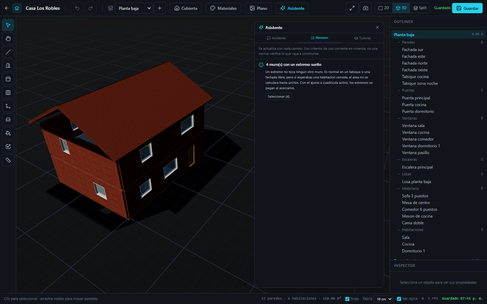 | 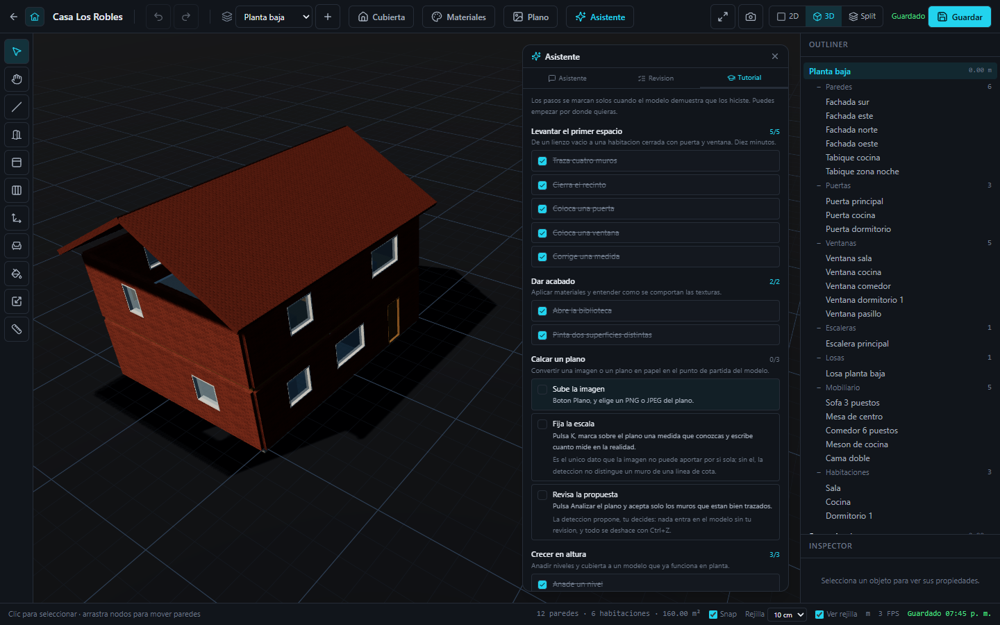 |

## 2.14 Paleta de comandos

`Ctrl+K` abre la paleta de comandos. Escribe para filtrar y pulsa `Enter` para ejecutar la acción. Incluye todas las herramientas, añadir planta, abrir el asistente, revisar el modelo y añadir cubiertas.

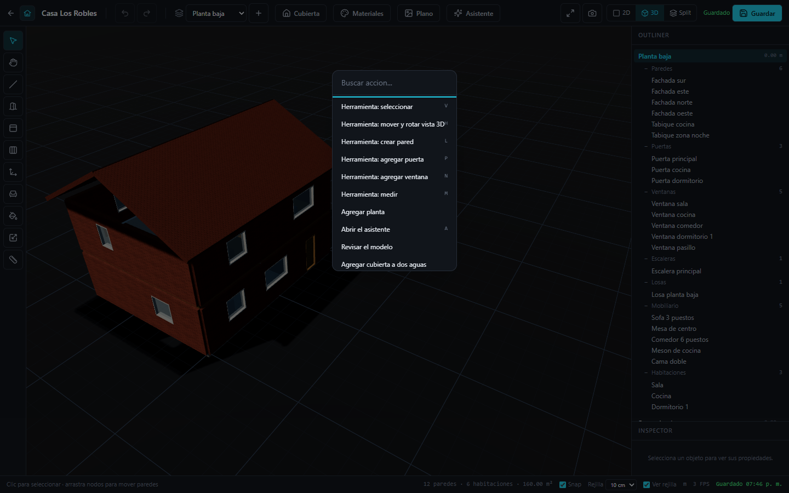

## 2.15 Configuración, facturación y papelera

| Sección | Ruta | Uso |
|---------|------|-----|
| Configuración | `/settings` | Preferencias de la cuenta y del espacio de trabajo |
| Perfil | `/settings/profile` | Nombre y datos del usuario |
| Facturación | `/settings/billing` | Plan actual, cambio a Pro o Studio (mensual o anual) y renovaciones |
| Papelera | `/trash` | Proyectos eliminados. Se pueden **restaurar** |

| Configuración | Facturación |
|---------------|-------------|
| 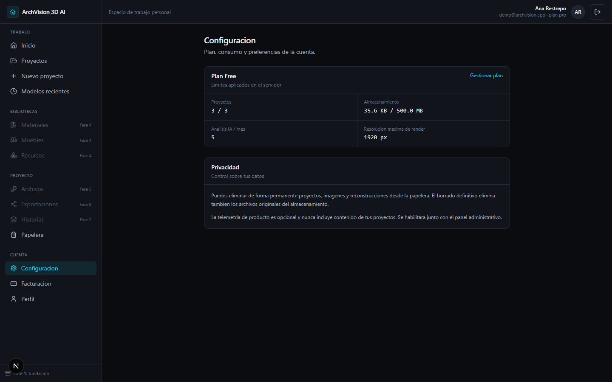 | 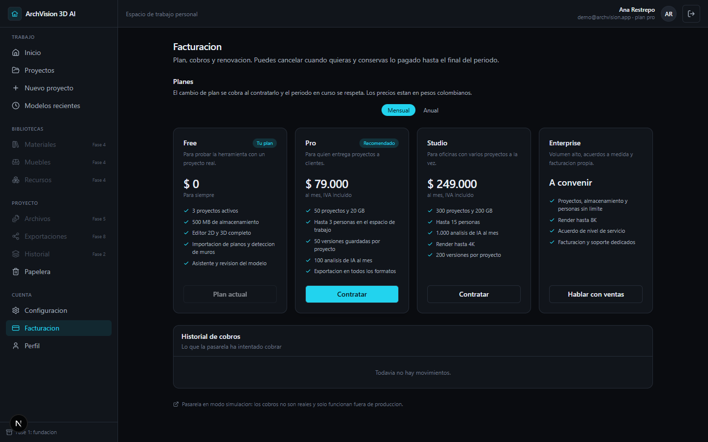 |

| Perfil | Papelera |
|--------|----------|
| 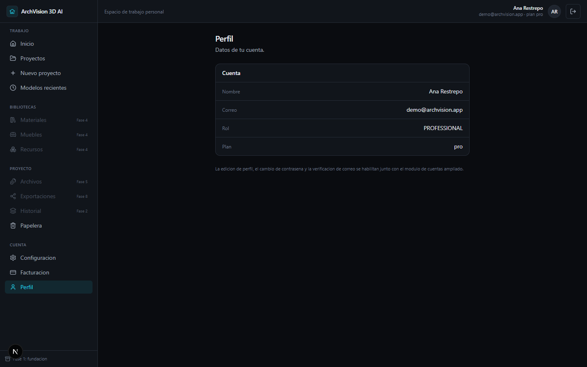 | 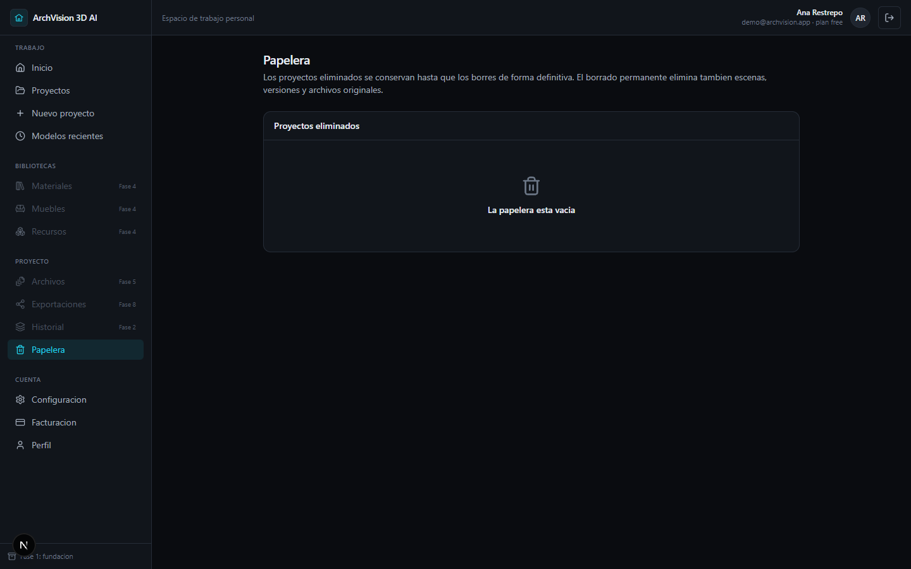 |

## 2.16 Atajos de teclado

| Tecla | Acción |
|-------|--------|
| `V` | Seleccionar |
| `H` o `Q` | Mover y rotar vista 3D *(nuevo)* |
| `L` | Pared |
| `P` | Puerta |
| `N` | Ventana |
| `C` | Columna |
| `B` | Mobiliario |
| `M` | Medir |
| `G` | Pincel y biblioteca de materiales |
| `K` | Calibrar plano |
| `A` | Abrir o cerrar el asistente |
| `F` | Centrar la selección |
| `1` / `2` / `3` / `0` | Vista frontal / lateral / superior / perspectiva |
| `Tab` | Alternar 2D → 3D → Split |
| `Supr` / `Retroceso` | Eliminar la selección |
| `Esc` | Cancelar, cerrar la paleta y quitar la selección |
| `Ctrl+Z` | Deshacer |
| `Ctrl+Shift+Z` o `Ctrl+Y` | Rehacer |
| `Ctrl+A` | Seleccionar todo en la planta activa |
| `Ctrl+S` | Guardar ahora |
| `Ctrl+K` | Paleta de comandos |
| `Shift` al girar | Girar a saltos del incremento configurado |

> **Aviso:** los modelos generados automáticamente pueden tener errores de medidas. Verifica las medidas importantes antes de usarlas para construcción, presupuestos o trámites.
